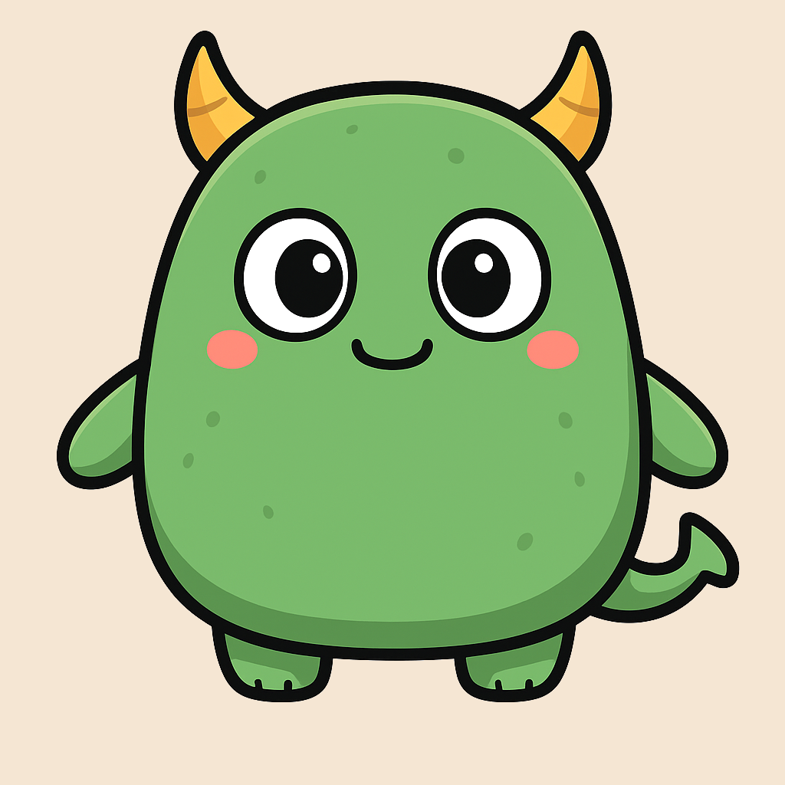

# 🐾 Tamagotchi Flutter

A Proof-of-Concept virtual pet application built with Flutter, featuring interactive gameplay, sensor integration, and engaging animations.

<p align="center">
  
</p>

### Sensor Integration
- **Pedometer Tracking**: Walk in real life to earn rewards! Every 1,000 steps increases your pet's energy and happiness
- **Accelerometer Support**: Shake your device to cure lice infestations
- **Gesture Recognition**: Swipe to pet your Tamagotchi or clean up messes

### Mini-Game
- **Number Guessing Game**: Play an interactive guessing game with your pet
- **Hints System**: Visual and text hints to guide your guesses
- **Score Tracking**: Earn points based on performance
- **Happiness Rewards**: Win to boost your pet's happiness

### Rich Animations
- **Lottie Animations**: Smooth, high-quality animations for all pet states
- **State-based Visuals**: Different animations for idle, eating, sleeping, playing, crying, and more
- **Priority System**: Important states (like lice attacks) interrupt normal activities

### Localization
- **Multi-language Support**: Available in English and French
- **Dynamic UI**: All text adapts to the selected language

## 🛠️ Tech Stack

- **Framework**: Flutter 3.7.2+
- **State Management**: BLoC Pattern ([flutter_bloc](https://pub.dev/packages/flutter_bloc))
- **Persistence**: SharedPreferences for local data storage
- **Animations**: Lottie for vector animations
- **Sensors**:
  - [sensors_plus](https://pub.dev/packages/sensors_plus) for accelerometer
  - [health](https://pub.dev/packages/health) for step counting
- **Localization**: [slang](https://pub.dev/packages/slang) for type-safe translations
- **Architecture**: Clean architecture with Repository pattern

## 📁 Project Structure

```
lib/
├── main.dart                   # Application entry point
├── app.dart                    # Root widget with BLoC providers
├── models/                     # Data models
│   ├── tamagotchi.dart        # Core pet model
│   └── visual_state.dart      # Animation states
├── config/                     # Configuration
│   └── tamagotchi_config.dart # Game constants and tuning
├── repository/                 # Data layer
│   └── tamagotchi_repository.dart
├── home/                       # Main screen
│   ├── bloc/                  # Home BLoC
│   ├── view/                  # UI components
│   └── widgets/               # Reusable widgets
├── game/                       # Mini-game
│   ├── bloc/                  # Game BLoC
│   └── view/                  # Game UI
├── achievements/               # Achievements system
├── splash/                     # Loading screen
└── utils/                      # Utilities
```

## 🚀 Getting Started

### Prerequisites

- Flutter SDK 3.7.2 or higher
- Dart SDK 3.0+
- iOS 12.0+ / Android SDK 21+

### Installation

1. Clone the repository:
```bash
git clone https://github.com/kdemont/tamagotchi_flutter.git
cd tamagotchi_flutter
```

2. Install dependencies:
```bash
flutter pub get
```

3. Generate translations (if modified):
```bash
dart run slang
```

4. Run the app:
```bash
flutter run
```

### Platform-Specific Setup

#### iOS
For pedometer features, add to `ios/Runner/Info.plist`:
```xml
<key>NSMotionUsageDescription</key>
<string>We need access to your step count to reward your Tamagotchi!</string>
<key>NSHealthShareUsageDescription</key>
<string>We need access to your step count to reward your Tamagotchi!</string>
```

#### Android
Ensure minimum SDK version is 28 in `android/app/build.gradle`:
```gradle
minSdkVersion 28
```

## 🎮 How to Play

1. **Name Your Pet**: Start by giving your Tamagotchi a unique name
2. **Monitor Stats**: Keep an eye on the four stat bars at the top of the screen
3. **Interact**: Use action buttons to feed, play, clean, and care for your pet
4. **Walk Together**: Take your device with you - your steps count!
5. **Play Games**: Visit the Game tab to play mini-games and earn happiness
6. **Stay Alert**: Random events like lice attacks or pooping require quick action

## ⚙️ Configuration

All game parameters can be adjusted in [`lib/config/tamagotchi_config.dart`](lib/config/tamagotchi_config.dart):

- Stat decay rates
- Action gains
- Event probabilities
- Thresholds and limits
- Animation priorities
