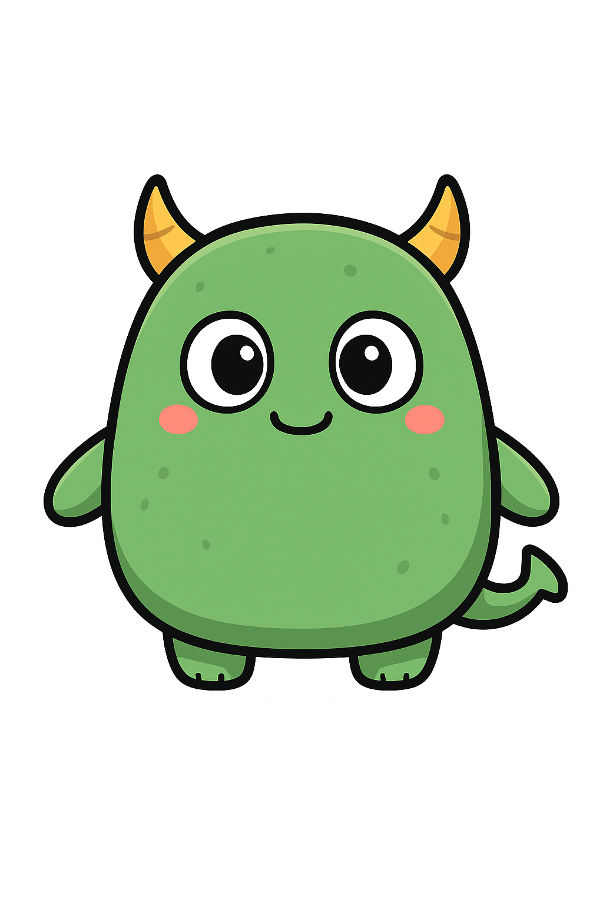

# Générations d'Assets

Nous avons utiliser plusieurs outils pour générer les assets graphiques de notre projet. Dans ce répertoire, vous trouverez les outils et scripts utiliser pour générer et manipuler ces assets.

## Génération des images

Les images de base ont été générées à l'aide de [ChatGPT](https://chat.openai.com). Les images que nous avions besoin étaient le background et le monstre.

## Génération des animations

Afin de créer des animations fluides pour le monstre, nous avons utilisé l'outil [runway](https://runwayml.com). Cet outil nous a permis de générer des courtes séquences vidéo (5s) animées à partir de l'image statique du monstre.

Les vidéos générées sont au format MP4 en 24 fps.

## Conversion en Lottie

Pour convertir les vidéos MP4 en animations Lottie, nous avons utilisé un [convertisseur en ligne](https://observablehq.com/@forresto/video-to-lottie). Cet outil nous a permis de transformer les vidéos en fichiers JSON compatibles avec Lottie, facilitant ainsi leur intégration dans notre projet.

Nous avons utilisé comme paramètres :
- Input FPS : 24 fps
- Scale output : 1
- JPG quality : 1
- Frame count : `maxFrameCountGuess` 

## Optimisation des fichiers Lottie

Pour réduire la taille des fichiers Lottie, nous avons ensuit utilisé l'outil [Tiny Lottie](https://www.tinylottie.studio/). Cet outil nous a permis de compresser les fichiers JSON tout en conservant une bonne qualité visuelle. 

## Suppression du fond blanc et watermark

Pour retirer le fond blanc et le watermark, nous avons utilisé un script Python. Le script `remove_bg_and_watermark.py` lit chaque fichier Lottie, supprime les éléments indésirables, et sauvegarde le fichier nettoyé.

Pour retravailler certaines frames où le script n'a pas parfaitement fonctionné, il est possible d'extraire les frames en PNG, de les éditer manuellement (par exemple avec [PhotoFiltre7](https://www.photofiltre-studio.com/pf7.htm)), puis de les réintégrer dans le fichier Lottie à l'aide des scripts `extract.py` et `inject.py`.